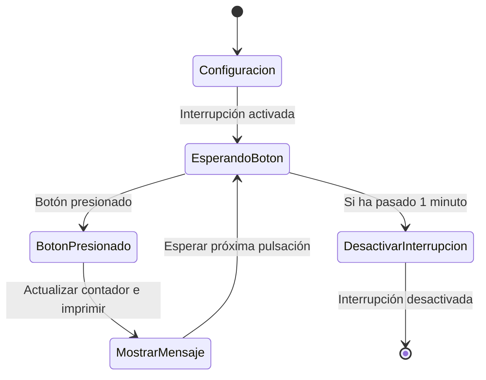
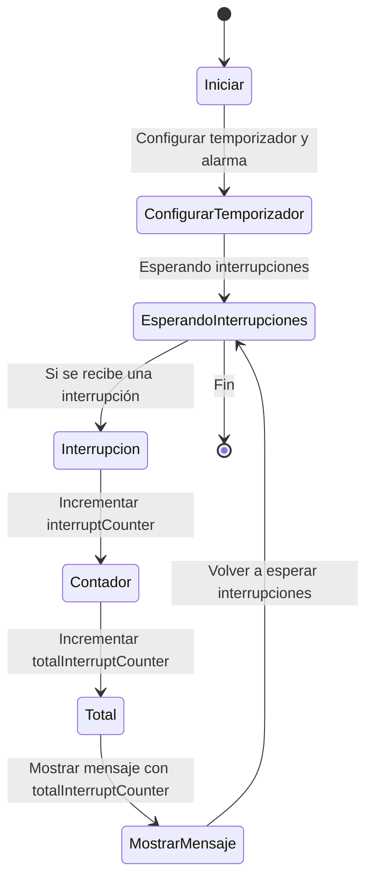

# Informe Práctica 2
## Practica A interrupción por GPIO
### Codigo
```cpp 
#include <Arduino.h>

struct Button { 
  const uint8_t PIN; 
  uint32_t numberKeyPresses; 
  bool pressed; 
 
}; 
Button button1 = {18, 0, false}; 
void IRAM_ATTR isr() { 
  button1.numberKeyPresses += 1; 
  button1.pressed = true; 
} 
void setup() { 
  Serial.begin(115200); 
  pinMode(button1.PIN, INPUT_PULLUP); 
  attachInterrupt(button1.PIN, isr, FALLING); 
} 
void loop() { 
  if (button1.pressed) { 
      Serial.printf("Button 1 has been pressed %u times\n", 
button1.numberKeyPresses); 
      button1.pressed = false; 
  } 

   //Detach Interrupt after 1 Minute 
   static uint32_t lastMillis = 0; 
   if (millis() - lastMillis > 60000) { 
     lastMillis = millis(); 
     detachInterrupt(button1.PIN); 
      Serial.println("Interrupt Detached!"); 
   } 
 } 
 ```

 ### Descripción del Código

#### Configuración Inicial

La función `setup()` prepara todo al principio, conectando el monitor serie a 115200 baudios y configurando el pin 18 para que reciba señales. Esto hace que el pin 18 esté normalmente "encendido", (HIGH) pero cuando presionas el botón, se conecta a tierra y se apaga (LOW).


#### Bucle Principal
Dentro del bucle principal (`loop()`), el programa realiza las siguientes operaciones:

- **Detección de Pulsaciones**: El programa revisa constantemente si el botón está presionado usando `digitalRead()`. Si el botón está presionado (el pin marca `LOW`), se suma 1 al contador de pulsaciones `numberKeyPresses` y se muestra el número total de pulsaciones en el monitor serie.
- **Rebote de Botón**: Para evitar que el programa cuente varias veces una misma pulsación debido al rebote del botón, se agrega un pequeño retardo con `delay(200)`.

### Detalles del Funcionamiento
1. **Detección de la Pulsación**: 
   Cuando el botón se presiona, el estado del pin 18 cambia a LOW.

2. **Contador de Pulsaciones**: 
   El contador `numberKeyPresses` se incrementa cada vez que se detecta el botón presionado.

3. **Impresión en el Monitor Serie**: 
   El número de pulsaciones se imprime en el monitor serie cada vez que el botón es presionado.

### Salidas del Monitor Serie

Cada vez que presionas el botón, el programa muestra en el monitor serie cuántas veces has presionado el botón hasta ese momento.

Donde `X` es el número total de veces que has presionado el botón. Este número aumenta cada vez que presionas el botón, por lo que puedes ver cómo va subiendo el contador en tiempo real.


En este caso, el botón ha sido presionado 5 veces, y el mensaje refleja ese número.

#### Mensajes de Desactivación y Reactivación de la Interrupción

1. **Desactivación de la Interrupción:**

   Si el botón no se presiona durante 1 minuto, el código desconectará la interrupción y mostrará el siguiente mensaje:


2. **Reactivación de la Interrupción:**

Si el botón se presiona después de que la interrupción haya sido desconectada, se volverá a activar y se imprimirá este mensaje:


#### Resumen de las Salidas
- El contador de pulsaciones muestra el número total de veces que el botón ha sido presionado.
- Si el botón no se presiona durante un minuto, la interrupción se desactiva y se muestra el mensaje "Interrupt Detached!".
- Si el botón es presionado después de 1 minuto sin pulsaciones, la interrupción se vuelve a activar y se muestra el mensaje "Interrupt Reattached!".


### Diagrama de Estados


## Practica B interrupción por timer
### Codigo
```cpp
#include <Arduino.h>

// Definición de la variable de interrupción
volatile int interruptCounter; 
int totalInterruptCounter; 
hw_timer_t * timer = NULL; 
portMUX_TYPE timerMux = portMUX_INITIALIZER_UNLOCKED; 

// Función que se ejecuta en la interrupción
void IRAM_ATTR onTimer() { 
  portENTER_CRITICAL_ISR(&timerMux); 
  interruptCounter++; 
  portEXIT_CRITICAL_ISR(&timerMux); 
} 

// Configuración inicial
void setup() { 
  Serial.begin(115200); 
  timer = timerBegin(0, 80, true); 
  timerAttachInterrupt(timer, &onTimer, true); 
  timerAlarmWrite(timer, 1000000, true); 
  timerAlarmEnable(timer); 
} 

// Bucle principal
void loop() { 
  if (interruptCounter > 0) { 
    portENTER_CRITICAL(&timerMux); 
    interruptCounter--; 
    portEXIT_CRITICAL(&timerMux); 

    totalInterruptCounter++; 

    Serial.print("An interrupt has occurred. Total number: "); 
    Serial.println(totalInterruptCounter); 
  } 
} 
```
### Descripción del Código

#### Configuración Inicial
En la función `setup()` se inicializa la comunicación serie a 115200 baudios. También se configura el temporizador para que genere una interrupción cada 1 segundo (1,000,000 microsegundos). Además, se asocia la función `onTimer()` a la interrupción que se ejecutará cuando el temporizador llegue a su límite.

#### Bucle Principal

Dentro de la función `loop()`, se verifica si se ha producido una interrupción (usando el contador `interruptCounter`). Cuando se detecta una interrupción, se decrementa el contador y se incrementa `totalInterruptCounter`, el cual lleva el conteo total de interrupciones. Después, se imprime el número de interrupciones en el monitor serie.

### Detalles del Funcionamiento
1. **Interrupción por Temporizador**: 
  Cada vez que el temporizador se activa, se ejecuta la función `onTimer()`, que incrementa el contador `interruptCounter`. Este contador se usa para saber si ha ocurrido una interrupción.

2. **Contador de interrupciones**: 
   El programa mantiene un contador total de interrupciones (`totalInterruptCounter`) que se incrementa cada vez que se detecta una interrupción. Este contador se imprime en el monitor serie.

3. **Impresión en el Monitor Serie**: 
 El número total de interrupciones (`totalInterruptCounter`) se imprime en el monitor serie, permitiendo ver cuántas veces se ha activado la interrupción.

### Salidas del Monitor Serie


Cada vez que se recibe una interrupción, el monitor serie muestra un mensaje con el número total de interrupciones. El mensaje es el siguiente:

`An interrupt has occurred. Total number:  X` 

Donde `X` es el número total de interrupciones que han ocurrido. Este número aumenta cada vez que pasa un segundo.


#### Resumen de las Salidas
-   **Mensaje de Interrupción**: El monitor serie muestra el número total de interrupciones cada vez que ocurre una interrupción.
    
-   **Contador de Interrupciones**: El contador `totalInterruptCounter` se incrementa cada vez que el temporizador genera una interrupción. Este valor se muestra en el monitor serie.
- 

### Diagrama de Estados



